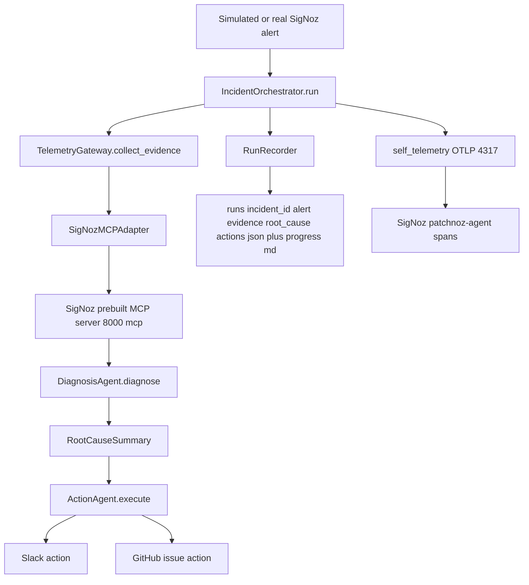

# PatchNoz

**AutoSRE-lite on top of SigNoz.** PatchNoz receives (or simulates) a SigNoz
alert, queries SigNoz telemetry through SigNoz's own **prebuilt MCP server**,
diagnoses a root cause, drafts remediation actions (Slack + GitHub), and
traces its own AI/tool workflow back into SigNoz with OpenTelemetry - so you
can watch the agent's own reasoning show up as spans next to the telemetry
it's investigating.

> PatchNoz does not ship its own MCP server as the product. SigNoz already
> has one; PatchNoz is a client of it.

## Architecture



Every box above the `RunRecorder`/`self_telemetry` branches runs inside a single
`patchnoz.incident.run` OpenTelemetry span, so the whole pipeline shows up as
one trace in SigNoz under the service name `patchnoz-agent`.

## Prerequisites

- SigNoz running locally (UI on `http://localhost:8080`, OTLP gRPC ingest on
  `localhost:4317`, prebuilt MCP server on `http://localhost:8000/mcp`).
- Python 3.11+ and the project's `venv` (see `venv/` — install
  `opentelemetry-{api,sdk,exporter-otlp-proto-grpc}` and `mcp` if setting up fresh).

## Running the demo

```bash
cd PatchNoz
source venv/bin/activate
python src/run_patchnoz.py --scenario checkout-payment-latency
```

This simulates a `checkout` latency/error alert (based on the OpenTelemetry
Demo's checkout → payment flow), collects real evidence from SigNoz,
diagnoses the root cause, drafts (or sends) remediation actions, writes
artifacts to `runs/demo-checkout-payment/`, and exports its own trace of the
run to SigNoz under service name `patchnoz-agent`.

Open `http://localhost:8080` → **Traces** → filter by service `patchnoz-agent`
to watch the agent's own pipeline: `patchnoz.incident.run` →
`patchnoz.telemetry.collect_evidence` → `patchnoz.signoz_mcp.call` (one per
SigNoz tool call) → `patchnoz.diagnosis.summarize` → `patchnoz.action.execute`
→ `patchnoz.action.slack` / `patchnoz.action.github`.

## Configuration (environment variables)

Copy [`.env.example`](./.env.example) to `.env` and fill in whatever you
have; PatchNoz loads it automatically on startup (via `python-dotenv`), so
you don't need to `export` anything by hand. Variables already set in your
shell always take priority over `.env`.

| Variable | Purpose | Default |
|---|---|---|
| `SIGNOZ_BASE_URL` | SigNoz UI/API base URL | `http://localhost:8080` |
| `SIGNOZ_MCP_URL` | SigNoz prebuilt MCP server URL | `http://localhost:8000/mcp` |
| `SIGNOZ_API_KEY` | SigNoz API key (preferred auth) | unset |
| `SIGNOZ_EMAIL` / `SIGNOZ_PASSWORD` / `SIGNOZ_ORG_ID` | Fallback login for the MCP adapter if no API key is set | unset |
| `OTEL_EXPORTER_OTLP_ENDPOINT` | Where PatchNoz sends its own spans | `http://localhost:4317` |
| `SLACK_WEBHOOK_URL` | Enables a real Slack post; otherwise the Slack action dry-runs | unset |
| `GITHUB_TOKEN` / `GITHUB_OWNER` / `GITHUB_REPO` | Enables a real GitHub issue; otherwise the GitHub action dry-runs | unset |

No credentials are hardcoded anywhere in the repo. Without any of the above
set, PatchNoz still runs end-to-end: SigNoz MCP calls fail gracefully into
`source: "error"` evidence items, and Slack/GitHub actions fall back to
`dry_run` results carrying the message/issue content that *would* have been
sent - all visible in `actions.json`.

## Repo layout

```text
src/
  models.py              # IncidentAlert, EvidenceItem, IncidentEvidence,
                          # RootCauseSummary, ActionResult, IncidentRun
  self_telemetry.py       # OTel setup: configure_tracing(), get_tracer(), start_span()
  signoz_mcp_adapter.py   # Thin client of SigNoz's prebuilt MCP server (JSON-RPC/HTTP)
  telemetry_gateway.py    # Normalizes SigNoz MCP responses into EvidenceItems
  diagnosis_agent.py      # Evidence -> RootCauseSummary (rule-based)
  action_agent.py         # RootCauseSummary -> ActionResults (Slack, GitHub)
  adapters/
    slack.py              # Slack Incoming Webhook (or dry-run)
    github.py             # GitHub issue creation (or dry-run)
    dashboard.py          # stretch: SigNoz dashboard/annotation creation (not implemented)
  run_recorder.py         # Persists runs/<incident_id>/*.json + progress.md
  orchestrator.py         # IncidentOrchestrator: owns pipeline ordering + failure handling
  run_patchnoz.py         # CLI entry point
  mcp_client.py           # Backward-compat re-export of SigNozMCPAdapter
  mcp_server.py           # DEMOTED - predates this architecture, not wired in
scripts/
  send_test_trace.py          # OTLP smoke test -> localhost:4317
  test_direct_jsonrpc.py      # Direct JSON-RPC calls to SigNoz MCP
  test_mcp_client.py          # Exercises the (demoted) src/mcp_server.py tools
  test_telemetry_gateway.py   # TelemetryGateway + DiagnosisAgent smoke test
runs/
  demo-checkout-payment/      # Artifacts from the last checkout-payment-latency run
```

See [`PROJECT_PROGRESS.md`](./PROJECT_PROGRESS.md) for a day-by-day build log
and [`patchnoz.md`](./patchnoz.md) for the original project brief and local
SigNoz stack notes.
