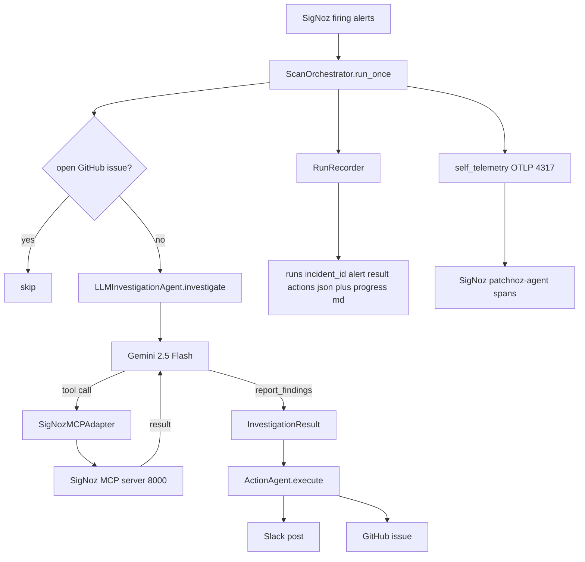

# PatchNoz

**AutoSRE-lite on top of SigNoz.** PatchNoz receives (or simulates) a SigNoz
alert, queries SigNoz telemetry through SigNoz's own **prebuilt MCP server**,
diagnoses a root cause, drafts remediation actions (Slack + GitHub), and
traces its own AI/tool workflow back into SigNoz with OpenTelemetry - so you
can watch the agent's own reasoning show up as spans next to the telemetry
it's investigating.

> PatchNoz does not ship its own MCP server as the product. SigNoz already
> has one; PatchNoz is a client of it.

## Architecture



The LLM agent calls SigNoz tools in a loop (up to `PATCHNOZ_MAX_TOOL_CALLS`),
deciding what to query based on what it finds — not a pre-planned sequence.
The loop ends when the agent calls `report_findings` with a structured JSON
diagnosis grounded in real evidence: specific error messages, actual p99
numbers, and affected user patterns observed in the telemetry.

## Prerequisites

- SigNoz running locally (UI on `http://localhost:8080`, OTLP gRPC ingest on
  `localhost:4317`, prebuilt MCP server on `http://localhost:8000/mcp`).
- Python 3.11+ and the project's `venv` (see `venv/` — install
  `opentelemetry-{api,sdk,exporter-otlp-proto-grpc}` and `mcp` if setting up fresh).

## Running

### Scan mode (recommended — any service, any alert)

```bash
cd PatchNoz
source venv/bin/activate

# Run once: investigate all currently firing SigNoz alerts
python src/run_scanner.py

# Run forever: scan every 15 minutes
python src/run_scanner.py --loop

# Custom interval (5 minutes)
python src/run_scanner.py --loop --interval 300
```

For each firing alert that doesn't already have an open GitHub issue, the LLM
agent calls SigNoz tools iteratively, finds the root cause, and posts to
Slack + GitHub automatically.

### Demo / single-alert mode

```bash
python src/run_patchnoz.py --scenario checkout-payment-latency
```

Runs the checkout-payment demo alert through the LLM agent (same pipeline,
hardcoded input instead of live SigNoz alerts).

In both modes, open `http://localhost:8080` → **Traces** → service
`patchnoz-agent` to watch the agent's own pipeline as OTel spans.

## Configuration (environment variables)

Copy [`.env.example`](./.env.example) to `.env` and fill in whatever you
have; PatchNoz loads it automatically on startup (via `python-dotenv`), so
you don't need to `export` anything by hand. Variables already set in your
shell always take priority over `.env`.

| Variable | Purpose | Default |
|---|---|---|
| `GEMINI_API_KEY` | **Required.** Free key at [aistudio.google.com](https://aistudio.google.com) | unset |
| `GEMINI_MODEL` | Gemini model to use | `gemini-2.5-flash` |
| `PATCHNOZ_MAX_TOOL_CALLS` | Max SigNoz tool calls per investigation | `12` |
| `PATCHNOZ_SCAN_INTERVAL_SECS` | Seconds between scan cycles in `--loop` mode | `900` |
| `SIGNOZ_BASE_URL` | SigNoz UI/API base URL | `http://localhost:8080` |
| `SIGNOZ_MCP_URL` | SigNoz prebuilt MCP server URL | `http://localhost:8000/mcp` |
| `SIGNOZ_API_KEY` | SigNoz API key (preferred auth) | unset |
| `SIGNOZ_EMAIL` / `SIGNOZ_PASSWORD` / `SIGNOZ_ORG_ID` | Fallback login for the MCP adapter if no API key is set | unset |
| `OTEL_EXPORTER_OTLP_ENDPOINT` | Where PatchNoz sends its own spans | `http://localhost:4317` |
| `SLACK_WEBHOOK_URL` | Enables real Slack posts; dry-runs if unset | unset |
| `GITHUB_TOKEN` / `GITHUB_OWNER` / `GITHUB_REPO` | Enables real GitHub issues; dry-runs if unset | unset |

No credentials are hardcoded anywhere in the repo. Without any of the above
set, PatchNoz still runs end-to-end: SigNoz MCP calls fail gracefully into
`source: "error"` evidence items, and Slack/GitHub actions fall back to
`dry_run` results carrying the message/issue content that *would* have been
sent - all visible in `actions.json`.

## Repo layout

```text
src/
  models.py              # IncidentAlert, InvestigationResult, ActionResult, IncidentRun
  self_telemetry.py       # OTel setup: configure_tracing(), get_tracer(), start_span()
  signoz_mcp_adapter.py   # Thin client of SigNoz's prebuilt MCP server (JSON-RPC/HTTP)
  llm_agent.py            # LLMInvestigationAgent: Gemini bare-API tool loop -> InvestigationResult
  scan_orchestrator.py    # ScanOrchestrator: list_alerts -> deduplicate -> investigate -> act
  action_agent.py         # InvestigationResult -> ActionResults (Slack, GitHub)
  adapters/
    slack.py              # Slack Incoming Webhook (or dry-run)
    github.py             # GitHub issue creation + find_open_issue deduplication (or dry-run)
    dashboard.py          # stretch: not implemented
  run_recorder.py         # Persists runs/<incident_id>/*.json + progress.md
  orchestrator.py         # IncidentOrchestrator: single-alert pipeline (used by demo mode)
  run_patchnoz.py         # CLI entry point (demo / single-alert mode)
  run_scanner.py          # CLI entry point (scan mode -- any service, any alert)
  mcp_client.py           # Backward-compat re-export of SigNozMCPAdapter
scripts/
  send_test_trace.py      # OTLP smoke test -> localhost:4317
  test_direct_jsonrpc.py  # Direct JSON-RPC calls to SigNoz MCP
runs/
  demo-checkout-payment/  # Artifacts from previous runs
docs/
  adr/
    0001-llm-agent-replaces-rule-based-diagnosis.md
CONTEXT.md               # Domain glossary (Alert, Investigation, InvestigationResult, ...)
```

See [`docs/ARCHITECTURE.md`](./docs/ARCHITECTURE.md) for a deep,
module-by-module reference of the current flow and every component (updated
as the codebase evolves), [`PROJECT_PROGRESS.md`](./PROJECT_PROGRESS.md) for
a day-by-day build log, and [`patchnoz.md`](./patchnoz.md) for the original
project brief and local SigNoz stack notes.
