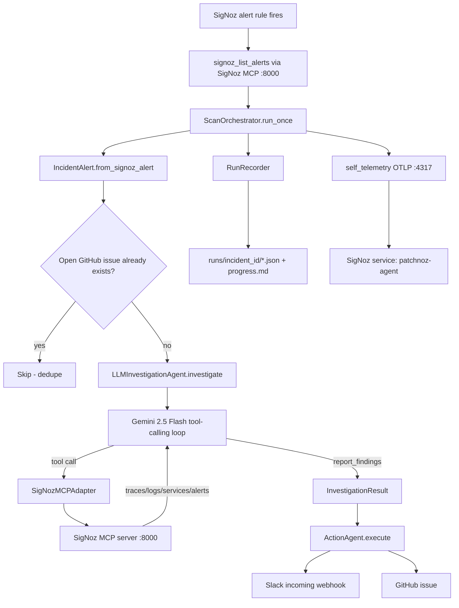

# PatchNoz Architecture — Flow & Component Reference

This is the deep reference for how PatchNoz actually works today, module by
module. For the elevator pitch and setup steps, see [`README.md`](../README.md).
For the historical project brief and local SigNoz stack notes, see
[`patchnoz.md`](../patchnoz.md) (some of it now describes a superseded design —
see the note at the top of that file's Section 4). For domain vocabulary, see
[`CONTEXT.md`](../CONTEXT.md).

## 1. End-to-end flow

There are two entry points that both terminate in the same investigate/act
pipeline:

- **Scan mode** (`run_scanner.py` → `ScanOrchestrator`) — the real path.
  Polls SigNoz for every currently firing alert, across any service, and
  investigates each one that doesn't already have an open GitHub issue.
- **Demo mode** (`run_patchnoz.py` → `IncidentOrchestrator`) — a single
  hardcoded `IncidentAlert` (the `checkout-payment-latency` scenario) run
  through the identical LLM investigation + action pipeline, without needing
  a real firing alert. Useful for demos and for testing the pipeline when
  nothing is actually broken in SigNoz.

Both orchestrators depend on the same three collaborators:
`LLMInvestigationAgent` (diagnose), `ActionAgent` (act), `RunRecorder`
(persist). Only `ScanOrchestrator` also does GitHub-issue deduplication
before investigating.

## 2. Component reference

### `src/models.py` — domain dataclasses

Plain dataclasses that flow through the whole pipeline. No behavior beyond
`to_dict()`/`to_json()`/`from_dict()`/`from_signoz_alert()`.

- **`IncidentAlert`** — the unit of work. Fields: `incident_id`, `alert_name`,
  `severity`, `affected_service`, `condition`, `time_range`,
  `suspected_area`, `timestamp`.
  - `from_signoz_alert(raw)` is the important one: it maps a raw SigNoz
    `list_alerts` row into an `IncidentAlert`. It reads `affected_service`
    from (in priority order) `labels.service_name` → `labels.service` →
    `labels.app` → `labels.job` → `raw.service_name`/`raw.service` →
    parsing `generatorURL`'s `service_name`/`service` query param → falls
    back to `"unknown"`. **This is why the alert-rule label
    `service_name: payment` matters** — it's the most direct path to a
    correct `affected_service`.
- **`InvestigationResult`** — the LLM agent's structured output. Carries
  real observed evidence (`error_message`, `affected_service_p99_ms`,
  `root_cause_error_rate_pct`, `affected_user_pattern`), reasoning
  (`confidence_pct` + `confidence_reasoning`, never just a bare number),
  fix steps, and **pre-rendered** `slack_one_liner` / `github_body` so the
  Slack/GitHub adapters don't need to re-derive prose from raw data.
- **`ActionResult`** — outcome of one Action (`name` ∈ {slack, github},
  `status` ∈ {success, dry_run, failed}, optional `url`, `details`).
- **`IncidentRun`** — the full record of one investigation: the alert, the
  result (once available), the actions taken, a `status` state machine
  (`initialized → investigating → acting → completed|failed`), and
  timestamps. `to_dict()` is what `RunRecorder` persists to disk.

### `src/signoz_mcp_adapter.py` — the only SigNoz-aware module

`SigNozMCPAdapter` is a thin JSON-RPC/HTTP client of **SigNoz's own prebuilt
MCP server** on `:8000/mcp`. PatchNoz does not run a competing MCP server;
this is intentional (see `docs/adr/0001-llm-agent-replaces-rule-based-diagnosis.md`
for the related decision to drop the rule-based diagnosis layer).

- **Auth**: prefers `SIGNOZ_API_KEY` (sent as header `SIGNOZ-API-KEY`); falls
  back to `SIGNOZ_EMAIL`/`SIGNOZ_PASSWORD`/`SIGNOZ_ORG_ID` via
  `POST /api/v2/sessions/email_password`, caching the bearer token and
  retrying once on 401/403.
- **Native tools exposed**: `signoz_list_services`, `signoz_search_traces`,
  `signoz_search_logs`, `signoz_list_alerts` — called by name via
  `call_tool(tool_name, arguments)`, which wraps every call in a
  `patchnoz.signoz_mcp.call` OTel span.
- **`list_firing_alerts()`** — calls `signoz_list_alerts`, then
  `_extract_alert_dicts()` recursively normalizes whatever shape SigNoz
  returns (flat list, `{"data": [...]}`, `{"data": {"alerts": [...]}}`,
  grouped rules each with nested `alerts: [...]`, etc.) into a flat list of
  alert dicts, then filters to states considered "firing"
  (`firing`/`alerting`/`active`/unset — anything not explicitly
  `resolved`/`pending`/`inactive`/`disabled`/`ok`/`normal`).
- **`_parse_result()`** — SigNoz's MCP server nests its actual JSON payload
  as a string inside `result.content[0].text`, sometimes fenced in triple
  backticks. This method extracts and parses it back into a dict.
- `src/mcp_client.py` is a thin backward-compat re-export of this module
  (`SigNozDirectMCPClient` = `SigNozMCPAdapter`); nothing new should import
  from it.

### `src/llm_agent.py` — `LLMInvestigationAgent`

A bare Gemini API tool-calling loop (no LangChain/agent framework). Given
one `IncidentAlert`, it:

1. Sends a system prompt + the alert's details to Gemini
   (`GEMINI_MODEL`, default `gemini-2.5-flash`, `temperature=0.1`).
2. Offers Gemini two tool groups: `_SIGNOZ_TOOLS` (mirrors the adapter's
   four native tools) and `_REPORT_TOOL` (the `report_findings`
   pseudo-tool the model calls when it's done investigating).
3. Loops up to `PATCHNOZ_MAX_TOOL_CALLS` (default 12) real tool calls,
   executing each via `SigNozMCPAdapter`, pruning the response to a
   diagnostic allowlist of fields (`_TRACE_KEEP`, `_LOG_KEEP`,
   `_LOG_ATTRS_KEEP` — trims payloads to keep per-investigation input
   tokens around ~70k), and feeding the pruned result back as a function
   response.
4. Deduplicates identical repeated tool calls within one investigation
   (`seen_calls` set keyed on tool name + sorted args) so the model can't
   loop on the same query.
5. Terminates when the model calls `report_findings`, building an
   `InvestigationResult` from its structured args via `_build_result()`.

Every call is wrapped in a `patchnoz.llm.investigate` span carrying
`llm.model`, `llm.tool_calls`, `llm.confidence_pct`.

### `src/action_agent.py` — `ActionAgent`

Turns one `InvestigationResult` into exactly two `ActionResult`s: Slack and
GitHub, run sequentially inside a `patchnoz.action.execute` span, each
wrapped in its own `patchnoz.action.{slack,github}` child span. Failures in
one action don't affect the other — each is caught individually and
downgraded to `status="failed"` with the exception recorded on its span.

### `src/adapters/` — Action implementations

- **`slack.py`** — `build_message()` renders a Slack mrkdwn message around
  the LLM's pre-rendered `slack_one_liner`: severity emoji, evidence
  bullets (affected service p99, root cause error rate, affected user
  pattern if any), truncated error message code block, a confidence bar,
  numbered fix steps, and up to 6 SigNoz deep links. `post_summary()` posts
  it to `SLACK_WEBHOOK_URL` via `POST` with a JSON `{"text": ...}` body, or
  returns `status="dry_run"` with the rendered message in `details` if the
  webhook isn't configured.
- **`github.py`** — `build_issue()` renders a title
  (`[PatchNoz] {service}: {alert_name} (root cause: {root_cause_service})`)
  and prepends a metadata table to the LLM's pre-rendered `github_body`.
  `create_issue()` posts to `POST /repos/{owner}/{repo}/issues`, ensuring
  both a stable `patchnoz` label and a per-alert label exist first. Falls
  back to `status="dry_run"` if `GITHUB_TOKEN`/`GITHUB_OWNER`/`GITHUB_REPO`
  aren't all set. **`find_open_issue()`** is the deduplication primitive:
  it searches
  `repo:{owner}/{repo} is:issue is:open label:patchnoz:{service}:{alert_slug}`
  and returns the existing issue's URL if found — this is what
  `ScanOrchestrator` calls before investigating, so an ongoing alert doesn't
  spawn a new issue on every scan cycle.
- **`dashboard.py`** — stretch goal, not implemented (empty docstring only).

### `src/self_telemetry.py` — PatchNoz's own OpenTelemetry setup

`configure_tracing()` idempotently builds one process-wide `TracerProvider`
(resource `service.name=patchnoz-agent`) exporting via OTLP gRPC to
`OTEL_EXPORTER_OTLP_ENDPOINT` (default `localhost:4317` — the same
collector SigNoz itself ingests through). `start_span(name, attrs)` is the
context-manager every module uses instead of touching the OTel API
directly. `flush_telemetry()` force-flushes + shuts down the provider so
spans aren't lost when a short-lived CLI process exits. This is what makes
PatchNoz's own diagnose/act pipeline show up as traces inside SigNoz, right
next to the telemetry it's investigating (span names are listed in the
module's own docstring and in `CONTEXT.md`).

### `src/run_recorder.py` — `RunRecorder`

Persists everything about one incident run to `runs/<incident_id>/`:
`alert.json`, `result.json`, `actions.json`, and a human-readable
`progress.md` (rewritten on every lifecycle transition, even on failure, so
a run directory always tells you what happened without needing to grep
logs). Lifecycle: `start()` on alert receipt, `update()` after each phase
change, `finish()` once terminal.

### `src/scan_orchestrator.py` — `ScanOrchestrator` (real/production path)

Implements the **Scan cycle** (see `CONTEXT.md`): `run_once()` calls
`SigNozMCPAdapter.list_firing_alerts()`, converts each raw row to an
`IncidentAlert`, and for each one not already covered by an open GitHub
issue (`find_open_issue`), runs the full investigate→act pipeline and
records it via `RunRecorder`. `run_forever()` loops `run_once()` on
`PATCHNOZ_SCAN_INTERVAL_SECS` (default 900s / 15 min), catching and logging
exceptions per cycle so one bad cycle doesn't kill the process.

### `src/orchestrator.py` — `IncidentOrchestrator` (demo/single-alert path)

Same investigate→act→record pipeline as `ScanOrchestrator`, but for exactly
one `IncidentAlert` passed in directly (no SigNoz polling, no GitHub
dedupe). Used by `run_patchnoz.py`'s hardcoded demo scenarios.

### CLI entry points

- **`run_scanner.py`** — `python src/run_scanner.py [--loop] [--interval N]`.
  The real way to run PatchNoz against a live SigNoz instance.
- **`run_patchnoz.py`** — `python src/run_patchnoz.py --scenario <name>`.
  Demo mode; currently one scenario, `checkout-payment-latency`.

### `src/mcp_server.py` — demoted, not part of the pipeline

An earlier design where PatchNoz shipped its *own* FastMCP server exposing
`get_recent_traces`/`get_recent_logs`/`get_metric_anomalies` on top of a
since-removed `TelemetryGateway`. Superseded by consuming SigNoz's prebuilt
MCP server directly (see `docs/adr/0001-llm-agent-replaces-rule-based-diagnosis.md`).
Not imported anywhere; kept only for reference. Do not build on it further.

### `src/env.py`

Loads a repo-root `.env` into `os.environ` exactly once via
`python-dotenv`, without overriding variables already set in the shell.
Imported at the top of every module that reads config as a module-level
constant at import time (`signoz_mcp_adapter.py`, `llm_agent.py`,
`self_telemetry.py`, `adapters/{slack,github}.py`), since `.env` must be
loaded before those constants are first evaluated.

### `scripts/` — one-off operational scripts (not part of the pipeline)

- **`send_test_trace.py`** — OTLP smoke test; emits one `test-manual` span
  to `localhost:4317` to confirm the collector path is alive.
- **`test_direct_jsonrpc.py`**, **`test_mcp_client.py`**,
  **`test_telemetry_gateway.py`** — manual/ad-hoc verification scripts used
  during development (not part of `tests/`'s automated suite).
- **`create_payment_alert.py`** (new) — creates a real SigNoz metric alert
  rule (`PaymentServiceHighErrorRate`) via SigNoz's REST API, so that the
  Scan cycle above has something real to pick up instead of only the demo
  scenario. See §3 below — **this is currently blocked**, not yet working.

### `tests/` — automated unit tests

- **`test_alert_layer.py`** — `IncidentAlert.from_signoz_alert()` mapping
  behavior (label priority, generatorURL fallback, severity/condition
  extraction).
- **`test_llm_agent.py`** — `LLMInvestigationAgent` tool-loop behavior
  (mocked Gemini client): dedup of repeated calls, tool budget enforcement,
  `report_findings` termination, result construction.
- **`test_scan_orchestrator.py`** — `_parse_firing_alerts()` shape
  normalization across the various SigNoz response shapes, and
  `ScanOrchestrator` dedupe/investigate flow with mocked collaborators.

## 3. In-progress: real SigNoz alert rule for the demo

**Goal:** give the Scan cycle a real firing alert to react to (error rate on
the OTel Demo's `payment` service > 5% for 5 min), instead of relying only
on the hardcoded `checkout-payment-latency` scenario.

**What exists:** `scripts/create_payment_alert.py` — logs into SigNoz
(`/api/v2/sessions/email_password`), lists existing rules, and
`POST`s a `PaymentServiceHighErrorRate` metric alert rule to
`/api/v1/rules` with labels `service_name=payment`, `severity=critical`
(so `IncidentAlert.from_signoz_alert()` extracts the service correctly).

**What was learned reverse-engineering SigNoz v0.133.0's (undocumented)
rule API:**

- `POST /api/v1/rules` requires `version: "v5"` and a `condition.compositeQuery.queries`
  array of `{type: "promql", spec: {name, query, disabled, step, legend}}`
  envelopes — the older `promQueries` list / `builderQueries` map formats
  from v3/v4 are silently accepted by validation but never evaluated by the
  ruler (see [SigNoz/signoz#10823](https://github.com/SigNoz/signoz/issues/10823)).
- `condition.op` / `condition.matchType` are numeric strings (`"1"` = above
  / at-least-once), `condition.target` is a float.
- **`ruleType` must be explicitly `"promql_rule"`** for a PromQL query —
  `processRuleDefaults()` only infers this from a top-level
  `compositeQuery.queryType` field that the v5 schema no longer uses for
  `queries`-array payloads, so it must be set explicitly or the rule
  manager fails to construct the right underlying `Rule` implementation.
- The API rejects rules with no notification channel
  (`"at least one channel is required"`). A notification channel must exist
  first: `POST /api/v1/channels` with a receiver-shaped body
  (`{"name": ..., "slack_configs": [{"api_url": ..., "channel": ..., "send_resolved": true}]}`
  — no `data` wrapper). One channel, **`patchnoz-slack`**, was created
  successfully this way, reusing the existing `SLACK_WEBHOOK_URL` from
  `.env`. `preferredChannels: ["patchnoz-slack"]` must then be set on the
  rule.

**Current blocker:** with all of the above applied, rule creation still
fails with `"error loading rules, previous rule set restored"` — this is a
*runtime construction* error (the JSON passes validation, but the rule
manager fails to build/load the actual `Rule` object from it and rolls
back), not a JSON schema error. Next debugging step: try setting
`"ruleType": "promql_rule"` explicitly (not yet attempted) and/or setting
`queryType` at the `compositeQuery` level in addition to per-query `type`.

**Fallback if the API keeps fighting us:** create the same rule by hand in
the SigNoz UI (`http://localhost:8080` → Alerts → New Alert Rule →
Metric-based, PromQL query
`sum(rate(signoz_calls_total{service_name="payment",status_code="STATUS_CODE_ERROR"}[5m])) / sum(rate(signoz_calls_total{service_name="payment"}[5m])) > 0.05`,
labels `service_name=payment`, `severity=critical`) — see the exact
click-path in `PROJECT_PROGRESS.md`'s Day 5 entry. The UI takes ~60 seconds
and sidesteps the undocumented API schema entirely.
